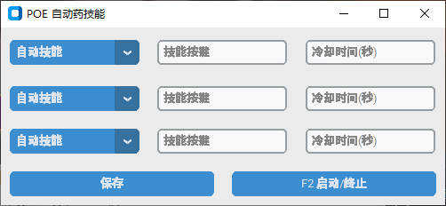

# EasyTasks

POE Auto Flask 是一个百分比自动吃药，自动释放有冷却光环的工具。

## 使用方法

POE Auto Flask 是一个 window 桌面应用，可以通过以下方式使用：

1. 下载并解压 POE 自动药技能
2. 打开 POE 自动药技能.exe，将看到下面的界面
   

3. 配置自动技能和自动吃药

    - 选择自动技能：先输入技能按键(需要大写)，再输入冷却时间(秒，例如：5)，在首次启动时会立即执行一次，然后重复冷却时间间隔执行。
    - 选择百分比吃药：先输入药的按键，再输入百分比(例如：50)，在降低到 50 及以下时则会自动吃药。
    - 配置好后需要保存再启动，如果已启动再修改，也需要保存重新启动。

4. 启动程序
   选择你的游戏，再按 F2 快捷键即可，启动和终止会有系统通知提醒。

注意：工具只有在 POE 为激活窗口时有效，在后台运行时无效。

## 功能

POE Auto Flask 提供以下功能：

-   自动技能
-   百分比吃药

## 许可证

POE Auto Flask 使用 MIT 许可证。请参阅 LICENSE 文件以获取更多信息。

## 致谢

感谢使用 POE Auto Flask！如有任何问题或建议，请随时联系我们。
